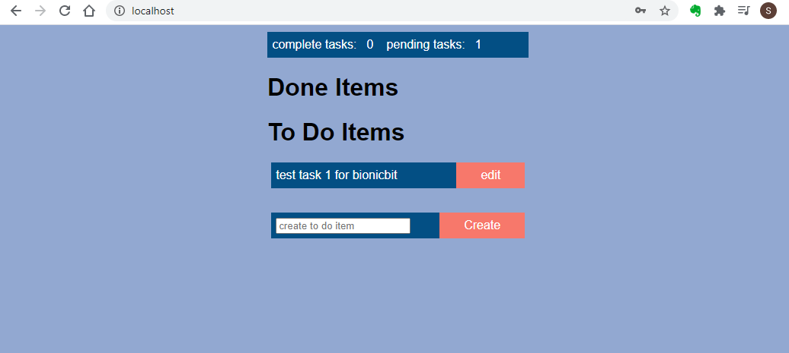

# rust-actix-webapp
This is a simple ToDo app clone executed in Rust.

To see the app in action, you need docker and docker-compose as the app has been dockerized.

To Execute:

after cloning the repo, there are 3 steps to run the app:

1. Use docker-compose to bring up all components ( webapp, ngingx and postgres backend )
docker-compose -f deploy/docker-compose.yml up -d

2. Perform the migration ( I am using diesel as the ORM )
docker container exec -t rust_app diesel migration run

3. Finally, add a user with by running the following curl command ( replace 'username' and 'password' with any string of your choice to login into the app )
curl -H "Content-Type: application/json" -X POST --data '{"name":"admin", "email":"admin", "password":"password"}' localhost/api/v1/user/create

4. access the app on localhost in your browser

